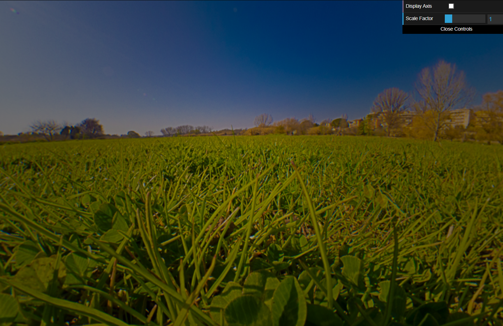
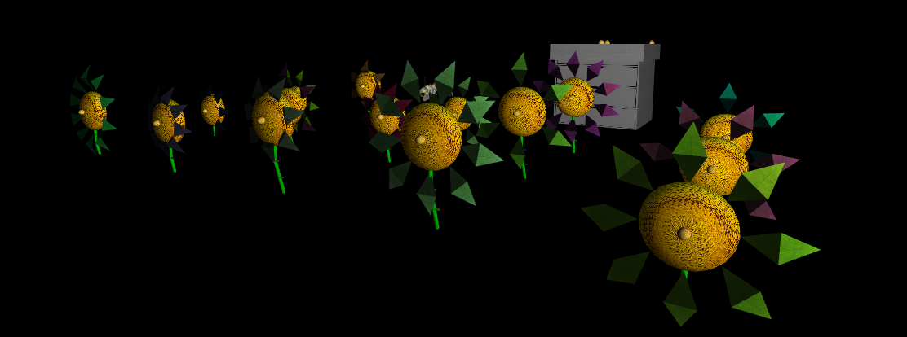
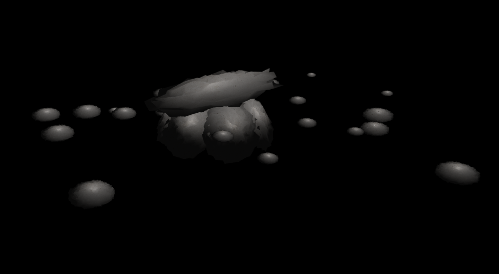
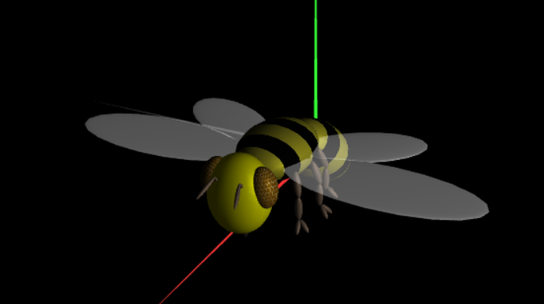
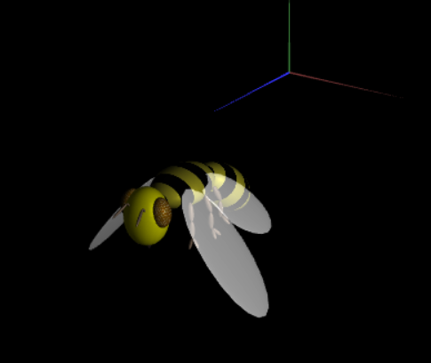
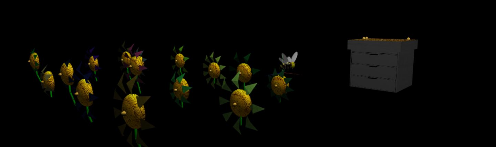
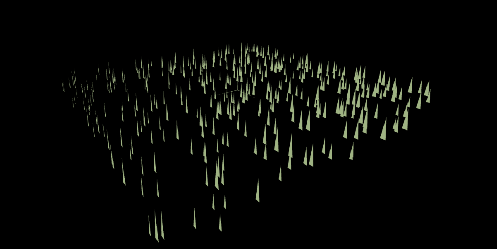

# Project T07-G09

| Name             | Number    | E-Mail             |
| ---------------- | --------- | ------------------ |
| Gonçalo Martins  | 202108707 | up202108707@up.pt  |
| Tomás Alves Moreira | 202108858 | up202108858@up.pt |

We tried to implement everything, some are good, others have bugs.

- W: Move in the direction the bee is facing.
- S: Brake the movement.
- A/D: Turning.
- O: Heads to the top of the hive and drops pollen (only doable when bee has pollen). 
- F: Heads to the closest flower and picks pollen (if flower has pollen and if bee does not have pollen already).
- P: Restore height (Because the flowers are at bee height, it will only resume the up and down animation).
- R: Reset to starting position (if done mid animation it will continue the animation until it finishes.). It sometimes bugs.

All Pollen and Hive animations have a slight bug whilst turning to the target, due to the `atan` function angle range, making the bee not move towards the target with the wrong direction.

## Panorama

## Flowers

## Rocks

## Bee Model 

## Bee Animation + Control + Model

## Pollen And Hive

## Grass

