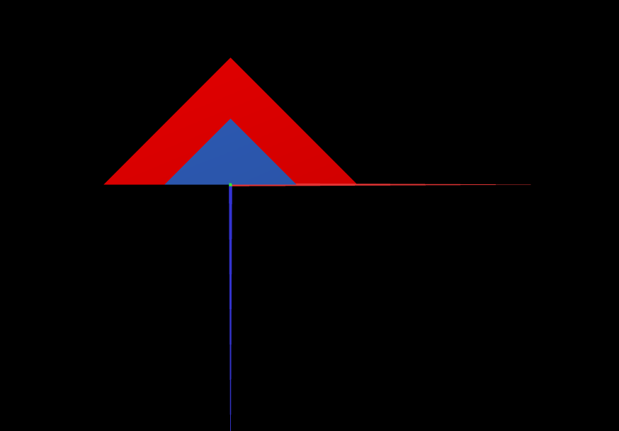

# CG 2023/2024

## Group T07G09

## TP 1 Notes

- In exercise 1 we observed that we had to repeat the indexes in a reversed order to get the parallelogram to be seen from both sides.

- In exercise 2 we struggled to get the big triangle in a different color so that both triangles could be distinguished while taking the screenshot.

