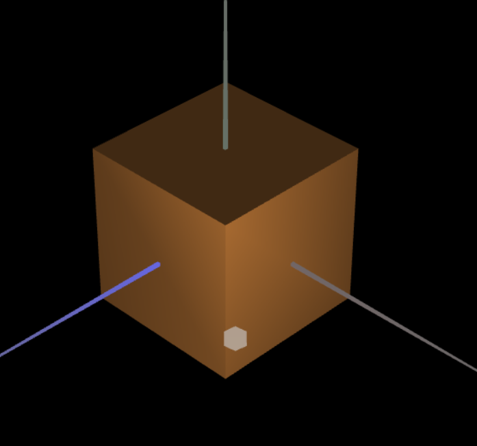

# CG 2023/2024

## Group T07G09

## TP 3 Notes

- In exercise 1 we started by copying the Tangram and the UnitCube files from the previous TP.
We then manually, 1 by 1, repeated the vertices and created the normals for the objects.
Then we created the 'Madeira' type material with 0.3 specular component and tested on the Cube:

