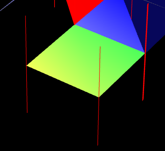
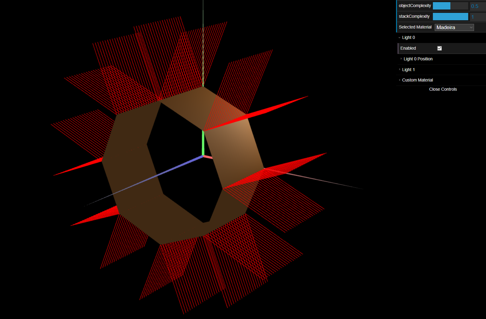
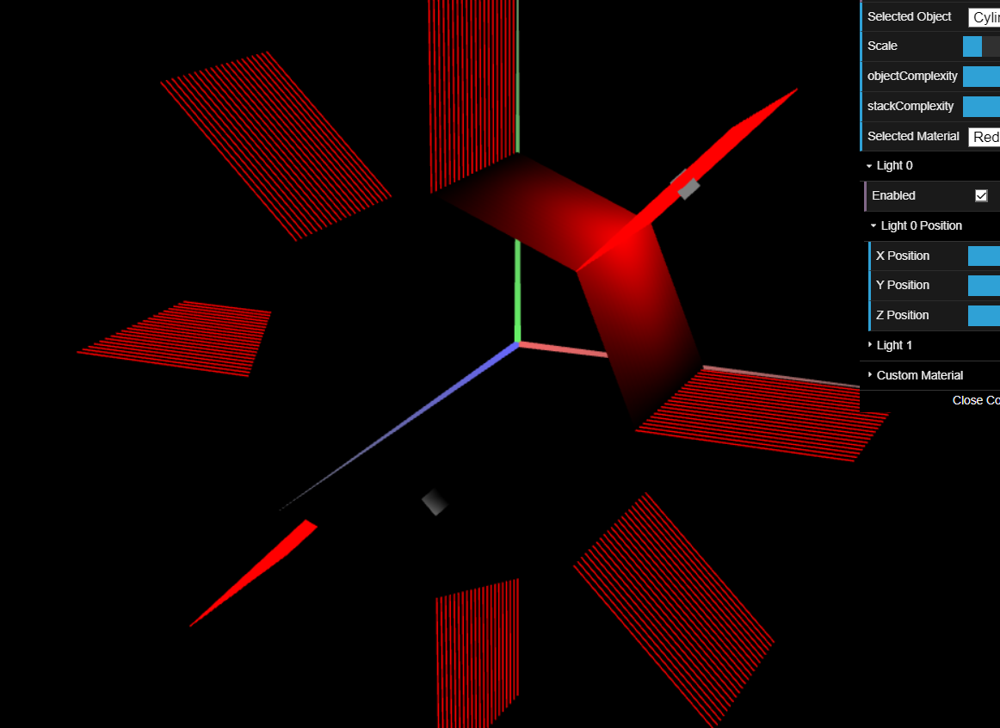

# CG 2023/2024

## Group T07G09

## TP 3 Notes

### Exercise 1
- In exercise 1 we started by copying the Tangram and the UnitCube files from the previous TP.
We grouped the cube's vertices by faces, therefore making it easier to understand how to define the indexes and normals.
Then we created the 'Madeira' type material with Ambient and Diffuse components with the function `hexToRgbA` and color `#A1662F`, and Specular component with the value of 0.3 across all colors and tested on the Cube:

We then did the normals for the Tangram, simply by repeating vertices and doing a normal upwards and another downwards on the y axis. After that we applied the Custom Material to the Tangram and took a screenshot of the MyDiamond sub-piece (we played around with the custom values)

### Exercise 2

- In exercise 2 we copied the `MyQuad.js` file from TP2 and changed it to `MyPrism` and added slices and stacks to the constructor. We calculated the vertices per side by dividing 180 by the number of slices we have.
We then calculated the normals with the use of cross product, normalized the resulting vector and adding them to the normals array.

Besides making the object alterable on the browser with the `objectComplexity` variable, which alters the bases number of sides from 2 to 10, we also created a variable `stackComplexity` so that we can divide the prism from 1 to 20 *floors*. We present below the prism with 8 slices and 20 stacks, with size 1 in Z.

### Exercise 3

- In exercise 2 we copied `MyPrism.js` to `myCylinder.js` and all we did was change the normals to *overlap* an invisible line from the center to the vertex.

